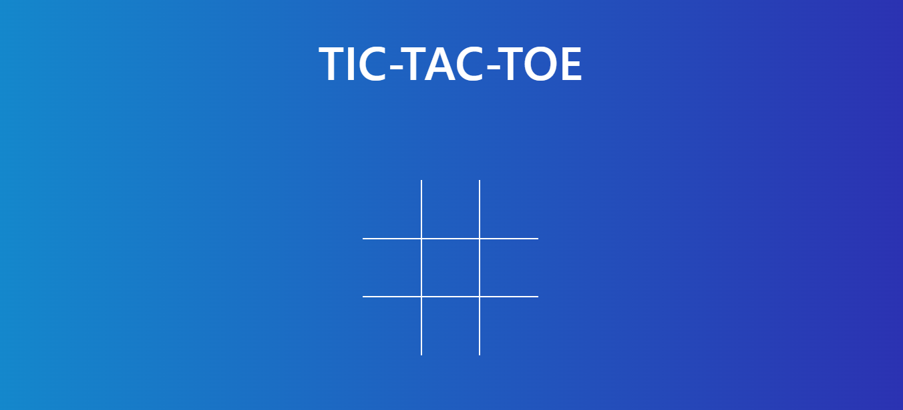
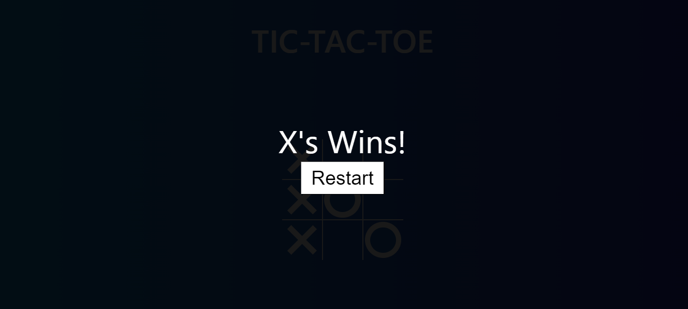

# Tic-Tac-Toe

Welcome to Tic-Tac-Toe! This is a simple implementation of the classic Tic-Tac-Toe game built using HTML, CSS, and JavaScript.

## How to Play

To play the game, simply open the `index.html` file in your web browser. The game starts with 'X' player. Click on any cell to place your mark ('X' or 'O'). The first player to get three of their marks in a row (horizontally, vertically, or diagonally) wins the game. If all cells are filled and no player has won, the game ends in a draw.

You can restart the game at any time by clicking the "Restart" button.

